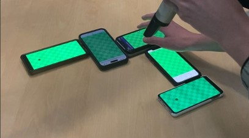

# Multigolf 2
> An online minigolf game where courses are made up of many connected phone screens

## Table of contents
* [About](#about)
* [How to play](#how-to-play)
* [How it works](#how-it-works)
* [Status](#status)

## About
Multigolf is a cross-device Minigolf game. Build courses out of 
multiple phones, then battle your friends in the available
gamemodes. Grab your friends, steal their phones and begin
building complex minigolf courses on any tabletop anywhere. 
It's extremely simple to setup and doesn't require any
download, everyone will simply scan a QR code and begin playing.
Sounds good? Then try it out!

## How to play

1. Visit [https://multi.golf](https://multi.golf)
2. Politely ask your friends to sacrifice their phones for a few minutes to build an awesomely huge minigolf course
3. Enjoy your awesomly huge minigolf course in an epic tournament

## How it works

By creating a game, your device will become the server. This server will not be able to show the course, but will rather function as a control center and will show you what to do. After configuring the game (choosing gamemode, entering names of
everybody...) you'll begin designing your course! You'll have
to tell the phones how they are arranged physically by drawing
lines along the connected edges. Once set up, the game is afoot!
Some gamemodes require multiple people to design their own
unique courses, so make sure to be creative with your course 
design!

## Status
The project is currently _IN DEVELOPMENT_, but already fully functional.